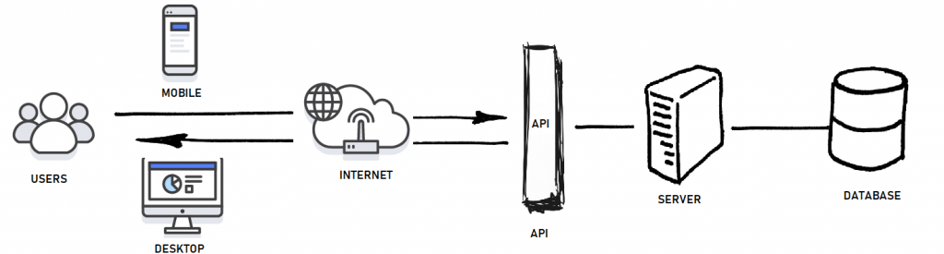
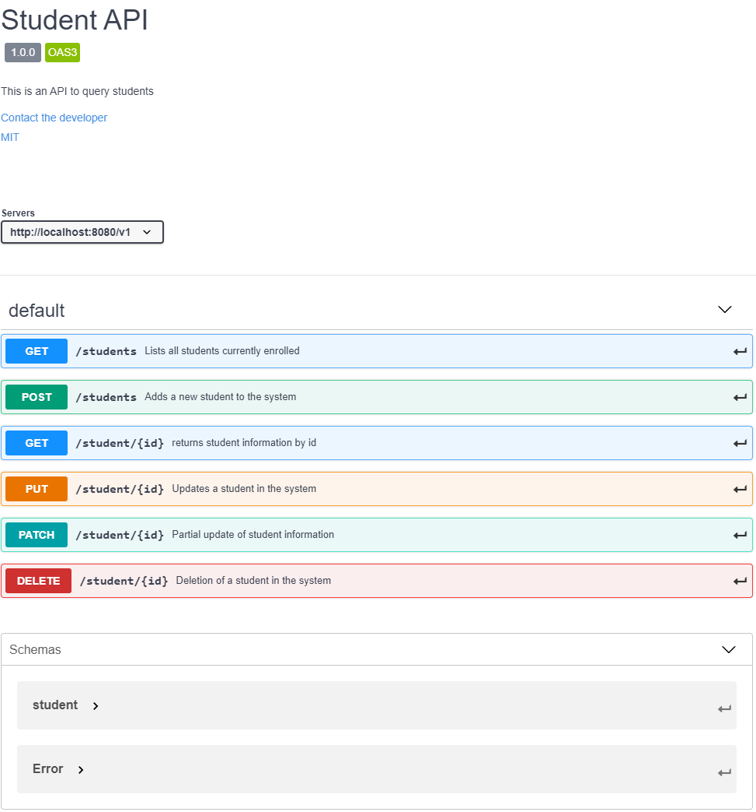
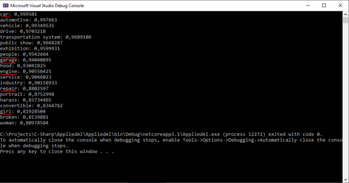

# AI Services as Web API

## Overview Web API



- An API serves as the interface between the user and your application
- It provides the offered services of your application in a structured way
- Users provide the necessary input as a request to your API and receive a response with the computed output
- What actually happens in your application is of no concern to the user

## Types of Web APIs

- REST (most commonly used)
- SOAP
- JSON-RPC
- XML-RPC

## Tools to create and test Web APIs

- [Swagger](https://swagger.io/) - Design, Code generation, Documentation
- [Postman](https://www.postman.com/) - Design, API Testing, Automation, Documentation
- [SoapUI](https://www.soapui.org/) - Testing, Automation
- many more

### Example Swagger

- An API can defined with Swagger as a yaml file (not much more than a simple text file)
- From that definition, code and documentation can automatically be generated

```yaml
openapi: 3.0.0
info:
  description: This is an API to query students
  version: "1.0.0"
  title: Student API
  contact:
    email: yourmail@hs-esslingen.de
  license:
    name: MIT
    url: 'https://opensource.org/licenses/MIT'
paths:

  /students:
    get:
      summary: Lists all students currently enrolled
      operationId: listStudents
      responses:
        '200':
          description: Operation successful
          content:
            application/json:
              schema:
                type: array
                items:
                  $ref: '#/components/schemas/student'
        '500':
          description: Internal Server error

.
.
.
```

#### Created Documentation



## Example of an AI Service: Clarifai

- [Clarifai](https://www.clarifai.com/) is an AI-Service Platform that offers a wide range of AI powered applications
- You can use the services through their API ([Documentation](https://docs.clarifai.com/))
- Clarifai offers clients to interact with their API for many popular programming languages
- All these clients do is form a HTTP request, which you could also manually do but this would be a little bit more cumbersome
- You can also host your own model on Clarifai to make it available to others

### Example of a request

- Assume we want to classify objects found in a picture
- We can send an image to the API endpoint used for image classification and receive the results as response

#### Input


#### Output



#### Code (C#)

```C#
using System;
using System.Threading.Tasks;
using Clarifai.API;
using Clarifai.DTOs.Inputs;

namespace AppliedAI
{
    internal class Program
    {
        public static async Task Main()
        {
            // When passed in as a string
            var client = new ClarifaiClient("your API key");

            // When using async/await
            var res = await client.PublicModels.GeneralModel
                .Predict(new ClarifaiURLImage("https://www.hs-esslingen.de/fileadmin/_processed_/6/9/csm_Slider_Forschung_65fd2ee374.jpg"))
                .ExecuteAsync();

            // Print the concepts
            foreach (var concept in res.Get().Data)
            {
                Console.WriteLine($"{concept.Name}: {concept.Value}");
            }
        }
    }
}
```

## Other ways to host your Service

- [AWS](https://aws.amazon.com/)
- [Azure](https://azure.microsoft.com/en-us/)
- [Heroku](https://www.heroku.com/)
- etc.
