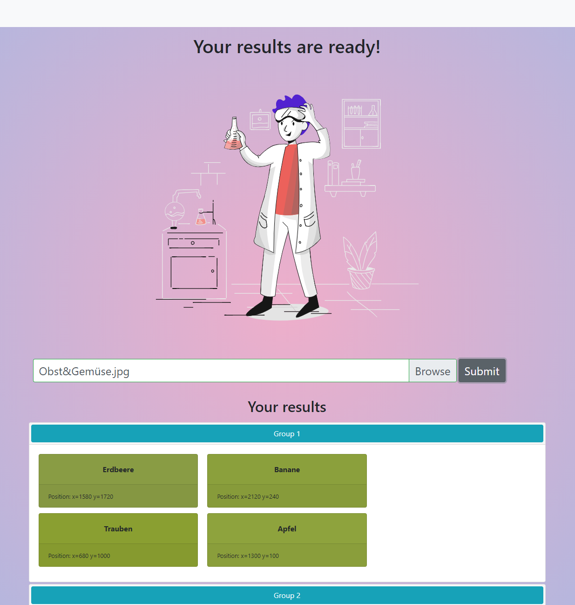

# postit-recognition

The webapp that demonstrates the API usage.



## Project setup

```console
npm install
```

### Compiles and hot-reloads for development

```console
npm run serve
```

### Compiles and minifies for production

```console
npm run build
```
